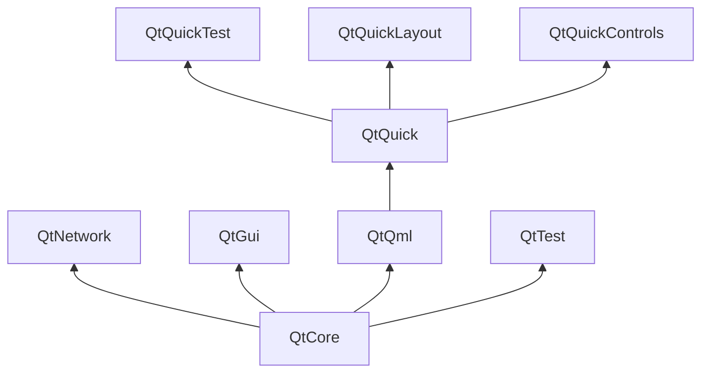

# Qt 构成

Qt 6 由大量模块组成。一般来说，我们将开发者使用的一个库就称为一个模块。某些模块对启用了 Qt 的平台是必要的，这些模块构成了名为*Qt 必要模块*的集合。其它可选模块组成了 *Qt 可选模块*。大部分开发者可能不需要使用后者，但是了解它们也是不错的，因为它们提供了对常见问题的有效解。
## Qt 模块

Qt 必要模块对启用了 Qt 的平台是必须的。它们提供了使用 Qt Quick 2 开发 Qt 6 应用的基础能力。完整的模块列表见[Qt 模块列表](https://doc.qt.io/qt-6/qtmodules.html#qt-essentials)。

## 核心基础模块

开始 QML 编程的最小模块集合。

* **Qt Core** - 其它模块使用的核心非图形化类。
* **Qt D-BUS** - Linux 平台通过 D-Bus 协议进行跨进程通讯使用的类。
* **Qt GUI** - 用于图形用户界面（GUI）的基类。包括 OpenGL。
* **Qt Network** - 用于简化网络编程的轻量类库。
* **Qt QML** - 用于 QML 和 JavaScript 语言的类。
* **Qt Quick** - 一个用于构建动态的用户自定义界面的神明式框架。
* **Qt Quick Controls** - 提供用于构建高性能桌面，嵌入式和移动设备用户界面的轻量级的 QML 类型。这些类型采用简单的样式结构，非常高效。
* **Qt Quick Layouts** - 布局用于安排基于 Qt Quick 2的组件在用户界面上的位置。
* **Qt Quick Test** - 用于 QML 应用的单元测试框架，其中的测试用例写起来像 JavaScript 函数。
* **Qt Test** - 用于 Qt 应用单元测试的类。
* **Qt Widgets** - 继承 C++ 编写的 Qt GUI 组件类。

## Qt 附加模块

除了基础模块外，Qt 还提供了用于特殊目的的附加模块。很多附加模块是功能完备的，或者为了向前兼容而存在，又或者只用于特定平台。以下是部分附加模块的列表，完整列表参见 [Qt 文档附件模块列表](https://doc.qt.io/qt-6/qtmodules.html#qt-add-ons)。

* **网络**: Qt Bluetooth（蓝牙） / Qt Network Authorization（网络认证）
* **UI 组件**: Qt Quick 3D / Qt Quick Timeline / Qt Charts（图表） / Qt Data Visualization（数据可视化） / Qt Lottie Animation / Qt Virtual Keyboard（虚拟键盘）
* **图形**: Qt 3D / Qt Image Formats / Qt OpenGL / Qt Shader Tools / Qt SVG / Qt Wayland Compositor
* **助手类**: Qt 5 Core Compatibility APIs（核心兼容API） / Qt Concurrent（协程） / Qt Help（帮助） / Qt Print Support（打印支持） / Qt Quick Widgets / Qt SCXML / Qt SQL / Qt State Machine / Qt UI Tools / Qt XML

::: tip 提示
因为这些模块不是发行版的一部分，所以每个模块的状态取决于贡献者的活跃度和测试程度。
:::

## 支持的平台

Qt 支持主流的桌面和嵌入式平台在内的大量平台。必要的话，现在利用 Qt 平台的抽象将其移植到您的平台比以往任何时候都简单。

在任意平台上测试 Qt 6 都是一项耗时的工作。所以 Qt 工程挑选了部分平台作为常用平台。在这些平台上，Qt 通过完整的系统测试确保最佳的代码质量。不过，请牢记，没有代码不会出错。

# Qt 工程

来自 [Qt 百科](http://wiki.qt.io/):

> “Qt 百科是一个基于精英共识的关注 Qt 的社区。任何对其感兴趣的人可以加入社区，参与决定进行，为 Qt 开发贡献一份力。”

Qt 百科是一个 Qt 用户和贡献者可以分享其观点的地方。它构成了其他用户做出贡献的基础。最大的贡献者是 Qt 公司，其持有 Qt 的商业版权。

Qt 对企业存在开源授权和商业授权。商业方面适用于不能或不会遵守开源许可证的公司。没有商业授权的话，这些公司将没有机会使用 Qt，Qt 公司也无法开发如此多的 Qt 代码。

全球有许多公司，它们以在各种平台上使用Qt提供咨询和产品开发为生。也有很多开源项目和开源开发者，他们将 Qt 作为其主要依赖。成为这个充满活力的社区的一员，使用这些令人赞不绝口的工具和库令人感觉不错。它是否让你成为更好的自己？大概:-)

**欢迎光临：http://wiki.qt.io/**
